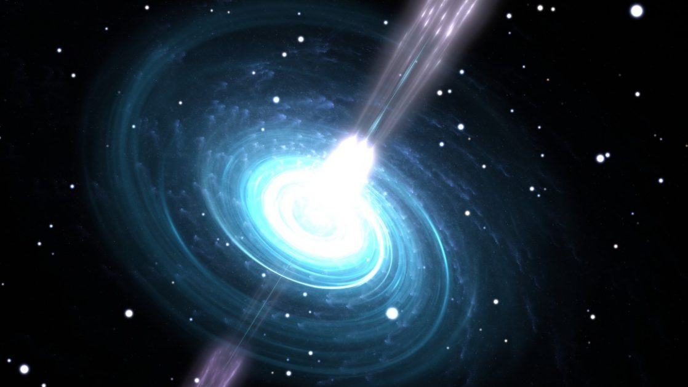

# Pulsar_star_prediction

A random forest classifier model to distinguish pulsar stars from others . 

The dataset used in this project is HTRU2 , which describes a sample of pulsar candidates collected during the High Time Resolution Universe Survey .

Pulsars are a rare type of Neutron star that produce radio emission detectable here on Earth. They are of considerable scientific interest as probes of space-time, the inter-stellar medium, and states of matter .

As pulsars rotate, their emission beam sweeps across the sky, and when this crosses our line of sight, produces a detectable pattern of broadband radio emission. As pulsars rotate rapidly, this pattern repeats periodically. Thus pulsar search involves looking for periodic radio signals with large radio telescopes. 

Features that have been taken into consideration to do the prediction task : 

Mean of the integrated profile.

Standard deviation of the integrated profile.

Excess kurtosis of the integrated profile.

Skewness of the integrated profile.

Mean of the DM-SNR curve.

Standard deviation of the DM-SNR curve.

Excess kurtosis of the DM-SNR curve.

Skewness of the DM-SNR curve.

Class

We calculated following  evalution metrics for this random forest model 

1) Precision

2) Recall

3) F score

4) AUC of ROC curve

The results were following : 

The precision score of the model is 0.9424460431654677

The recall score of the model is 0.8397435897435898

The F1 score of the model is 0.888135593220339

The ROC_AUC score of the model is 0.9174238144556383

The Confusion Matrix is as follows :

